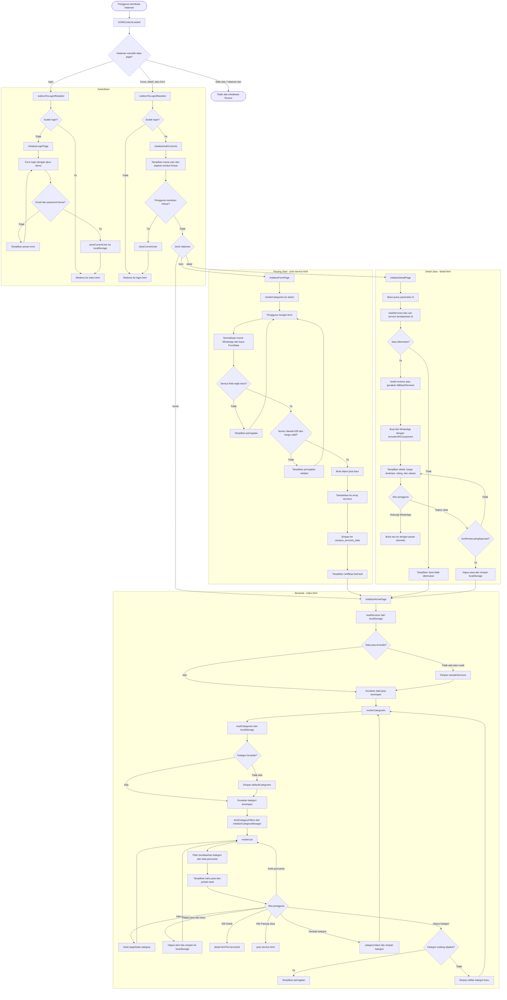

# Flowchart Alur Project PolsriJasa

Diagram berikut menggambarkan alur aktual project berdasarkan `main.js` dan halaman HTML yang memiliki `data-page`.

## Titik Penyimpanan Data

- `campus_services_data`: daftar jasa, termasuk jasa bawaan dan jasa baru.
- `campus_service_categories`: daftar kategori bawaan dan kategori tambahan.
- `polsrijasa_auth`: user demo yang sedang login.

## Catatan Pembacaan

- `main.js` memilih inisialisasi berdasarkan `document.body.dataset.page`.
- Halaman `index.html`, `post-service.html`, dan `detail.html` membutuhkan user yang sudah login.
- Flowchart ini mendokumentasikan perilaku kode saat ini, bukan rancangan fitur ideal dari PRD.
